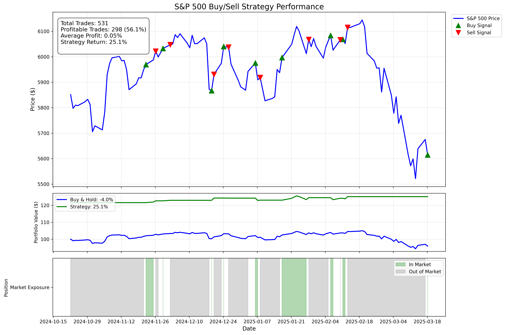

# StockTrend Forecaster

This repository contains a machine learning model for predicting the movement (up/down) of S&P 500 stocks using a Random Forest classifier. The goal is to reduce trade frequency while maximizing profits by predicting whether a stock will go up or down, without forecasting its exact price.

## Features

- **Stock Movement Prediction**: Predicts whether a stock's price will go **up** or **down** based on historical data.
- **Low Trade Frequency**: Designed to minimize unnecessary trades while aiming to increase overall profitability.
- **Random Forest**: Utilizes the Random Forest algorithm to classify stock movements with high accuracy.
- **Buy/Sell Strategy**: Implements a realistic trading approach - buy when the model predicts an upward movement and sell when it next predicts a downward movement.
- **Performance Metrics**: Tracks win rate, average profit per trade, and compares strategy performance against buy-and-hold.

## How It Works

The model uses a combination of technical indicators and historical price patterns to make predictions:

1. **Data Collection**: Uses Yahoo Finance data to access historical S&P 500 prices
2. **Feature Engineering**: Creates predictive features including:
   - Price ratios across multiple time horizons (2, 5, 60, 250, 1000 days)
   - Moving averages and trend indicators
3. **Model Training**: Trains a Random Forest classifier with optimized parameters
4. **Backtesting**: Implements walk-forward validation to realistically test performance
5. **Strategy Execution**: Generates buy/sell signals based on prediction confidence thresholds

## Trading Strategy

The implemented trading strategy follows these rules:

- **Buy Signal**: When the model predicts the market will go up, you buy at the next day's opening price
- **Hold**: Continue to hold the position regardless of subsequent predictions
- **Sell Signal**: Only sell when the model next predicts the market will go down

This approach reduces overtrading and more realistically reflects how the model would be used in practice.

## Performance Metrics

The model performance is evaluated using:

- **Win Rate**: Percentage of profitable trades
- **Average Profit per Trade**: Mean return across all completed trades
- **Strategy Return**: Total return compared to buy-and-hold strategy
- **Sharpe Ratio**: Risk-adjusted performance metric
- **Maximum Drawdown**: Largest peak-to-trough decline
- **Market Exposure**: Percentage of time invested in the market

## Visualization

## License

This project is licensed under the BEER-WARE License - see the [LICENSE](LICENSE) file for details.
